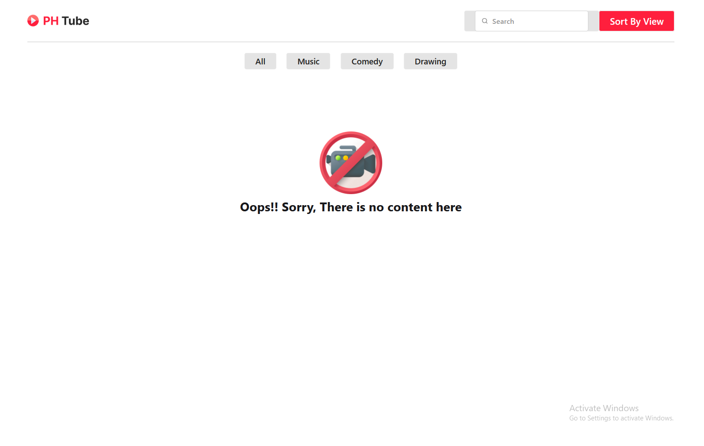

# 📺 Tube - Dynamic YouTube UI Clone with API Integration

**Tube** is a responsive and interactive front-end YouTube homepage clone built using **HTML**, **CSS**, and **JavaScript**. It fetches video data from the [Programming Hero API](https://openapi.programming-hero.com/api/phero-tube) and displays categories, video thumbnails, channel details, and more in real-time.

🌐 **Live Site:** [tube-khadizacoder.netlify.app](https://tube-khadizacoder.netlify.app/)

---

## ✨ Features

- ✅ Real-time data fetching using `fetch()` and REST API
- 🎞️ Dynamic video display with thumbnail, title, views, channel info
- 📂 Load videos by category (e.g., Music, News, Comedy, etc.)
- 🔍 Search videos by title
- 📋 Modal popup with detailed video information
- 💡 Fallback UI when no videos are found
- 📱 Fully responsive (mobile-first)

---

## 🔗 API Source

Data is fetched from the open **Phero Tube API** provided by Programming Hero:

- 🔸 Categories: `https://openapi.programming-hero.com/api/phero-tube/categories`
- 🔸 All Videos: `https://openapi.programming-hero.com/api/phero-tube/videos?title=SEARCH_TERM`
- 🔸 Category Videos: `https://openapi.programming-hero.com/api/phero-tube/category/{category_id}`
- 🔸 Video Details: `https://openapi.programming-hero.com/api/phero-tube/video/{video_id}`

---

## 🧰 Technologies Used

| Tool          | Purpose                        |
|---------------|--------------------------------|
| HTML5         | Page structure                 |
| CSS3          | Styling & responsive layout    |
| JavaScript    | Fetch API, DOM manipulation    |
| REST API      | Fetching live video data       |
| Netlify       | Hosting the live version       |

---

🧠 Learning Purpose
This project was built to practice:
Using fetch API
Handling API data
Building modular JavaScript functions
Creating responsive layouts
Designing a full UI from scratch with dynamic data

## 📸 Project Preview

Here is a screenshot of the Tube UI:

#🙋‍♀️ Author

-Made with ❤️ by Khadiza Coder
